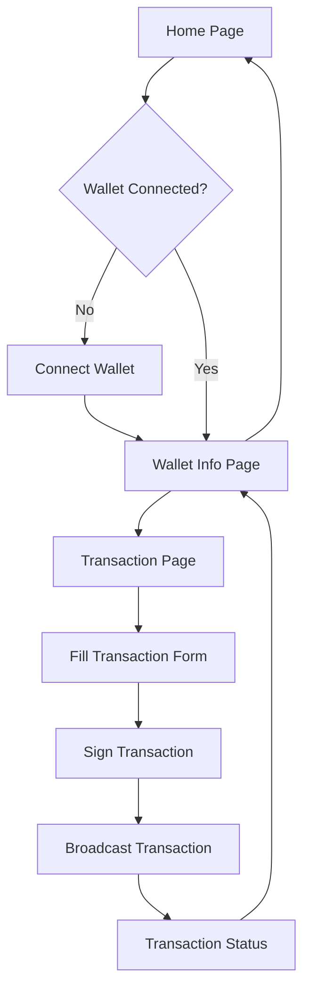

## 1. Product Overview

Ứng dụng Solana Wallet Utility là một web application được xây dựng với Next.js 15, cho phép người dùng kết nối với ví Solana và thực hiện các giao dịch cơ bản.

Ứng dụng giải quyết vấn đề kết nối và tương tác với blockchain Solana một cách đơn giản, phục vụ cho các developer và người dùng muốn quản lý ví Solana và thực hiện giao dịch.

Mục tiêu là tạo ra một công cụ tiện ích đơn giản, dễ sử dụng cho việc tương tác với Solana ecosystem.

## 2. Core Features

### 2.1 User Roles

Không cần phân biệt vai trò người dùng - tất cả người dùng đều có quyền truy cập đầy đủ các tính năng.

### 2.2 Feature Module

Ứng dụng Solana Wallet Utility bao gồm các trang chính sau:

1. **Home Page**: wallet connection, dashboard overview, navigation menu
2. **Wallet Info Page**: balance display, wallet details, transaction history
3. **Transaction Page**: transaction form, signing interface, broadcast functionality

### 2.3 Page Details

| Page Name | Module Name | Feature description |
|-----------|-------------|---------------------|
| Home Page | Wallet Connection | Connect/disconnect wallet using Solana wallet adapter, display connection status |
| Home Page | Dashboard Overview | Show basic wallet info summary, quick access to main features |
| Home Page | Navigation Menu | Navigate between different sections of the app |
| Wallet Info Page | Balance Display | Show SOL balance and SPL token balances with real-time updates |
| Wallet Info Page | Wallet Details | Display wallet public key, network info, copy address functionality |
| Wallet Info Page | Transaction History | List recent transactions with status and details |
| Transaction Page | Transaction Form | Input recipient address, amount, optional memo field with validation |
| Transaction Page | Signing Interface | Sign transaction using connected wallet, show transaction preview |
| Transaction Page | Broadcast Functionality | Send signed transaction to Solana network, track confirmation status |

## 3. Core Process

**Main User Flow:**
1. User visits the home page and connects their Solana wallet (Phantom, Solflare, etc.)
2. After connection, user can view wallet information including balance and transaction history
3. User can create new transactions by specifying recipient and amount
4. User signs the transaction using their wallet extension
5. Application broadcasts the signed transaction to Solana network
6. User can track transaction status and confirmation

## 4. User Interface Design

### 4.1 Design Style

- **Primary Colors**: Purple (#8B5CF6) for Solana branding, Blue (#3B82F6) for accents
- **Secondary Colors**: Gray (#6B7280) for text, Green (#10B981) for success states
- **Button Style**: Rounded corners (8px), gradient backgrounds, hover effects
- **Font**: Inter font family, 14px base size, 16px for headings
- **Layout Style**: Card-based design, clean spacing, responsive grid layout
- **Icons**: Lucide React icons, 20px standard size, consistent stroke width

### 4.2 Page Design Overview

| Page Name | Module Name | UI Elements |
|-----------|-------------|-------------|
| Home Page | Wallet Connection | Large connect button with wallet icons, connection status indicator with green/red colors |
| Home Page | Dashboard Overview | Card layout with balance summary, gradient backgrounds, clean typography |
| Wallet Info Page | Balance Display | Large balance numbers, token list with icons, refresh button, loading states |
| Wallet Info Page | Wallet Details | Monospace font for addresses, copy button with toast notifications |
| Transaction Page | Transaction Form | Input fields with validation, amount selector, memo textarea, form validation messages |
| Transaction Page | Signing Interface | Transaction preview modal, confirmation buttons, loading spinners |

### 4.3 Responsiveness

Ứng dụng được thiết kế desktop-first với responsive design cho mobile. Tối ưu hóa touch interaction cho mobile devices với button sizes phù hợp và gesture support.