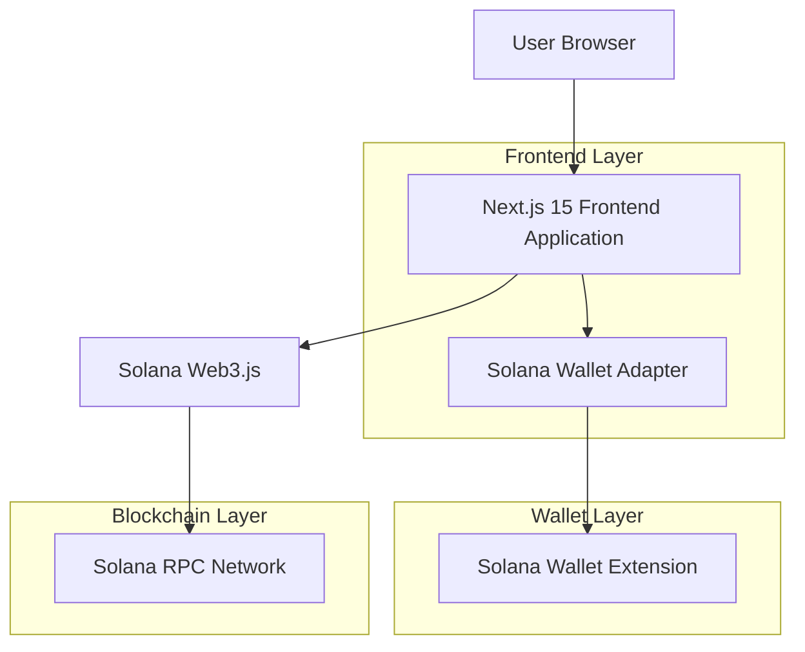
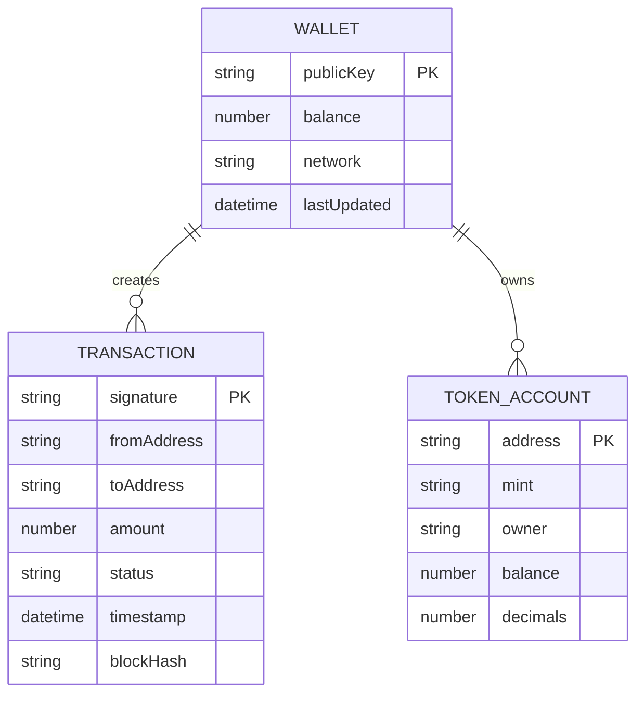

## 1. Architecture design



## 2. Technology Description

- Frontend: Next.js@15 + React@18 + TypeScript + Tailwind CSS
- Wallet Integration: @solana/wallet-adapter-react + @solana/wallet-adapter-wallets
- Blockchain: @solana/web3.js + @solana/spl-token
- UI Components: @headlessui/react + lucide-react
- Build Tool: Next.js built-in bundler

## 3. Route definitions

| Route | Purpose |
|-------|----------|
| / | Home page with wallet connection and main dashboard |
| /wallet | Wallet information display and management |
| /transaction | Transaction signing and broadcasting interface |

## 4. API definitions

### 4.1 Wallet Connection API

**Connect Wallet**
```typescript
interface WalletConnection {
  connect(): Promise<void>;
  disconnect(): Promise<void>;
  publicKey: PublicKey | null;
  connected: boolean;
}
```

**Wallet Info Response**
```typescript
interface WalletInfo {
  publicKey: string;
  balance: number;
  network: 'mainnet-beta' | 'testnet' | 'devnet';
}
```

### 4.2 Transaction API

**Sign Transaction**
```typescript
interface SignTransactionRequest {
  transaction: Transaction;
  options?: {
    skipPreflight?: boolean;
    preflightCommitment?: Commitment;
  };
}

interface SignTransactionResponse {
  signature: string;
  transaction: Transaction;
}
```

**Send Transaction**
```typescript
interface SendTransactionRequest {
  transaction: Transaction;
  connection: Connection;
  options?: {
    skipPreflight?: boolean;
    preflightCommitment?: Commitment;
    maxRetries?: number;
  };
}

interface SendTransactionResponse {
  signature: string;
  confirmationStatus: 'processed' | 'confirmed' | 'finalized';
}
```

## 5. Data model

### 5.1 Data model definition



### 5.2 TypeScript Interfaces

```typescript
// Wallet related types
interface WalletState {
  publicKey: PublicKey | null;
  connected: boolean;
  connecting: boolean;
  disconnecting: boolean;
}

interface WalletBalance {
  sol: number;
  tokens: TokenBalance[];
}

interface TokenBalance {
  mint: string;
  symbol: string;
  balance: number;
  decimals: number;
  uiAmount: number;
}

// Transaction related types
interface TransactionForm {
  recipient: string;
  amount: number;
  memo?: string;
}

interface TransactionStatus {
  signature: string;
  status: 'pending' | 'confirmed' | 'failed';
  confirmations: number;
  error?: string;
}

// Component Props
interface WalletButtonProps {
  className?: string;
  disabled?: boolean;
}

interface TransactionFormProps {
  onSubmit: (data: TransactionForm) => Promise<void>;
  loading?: boolean;
}
```