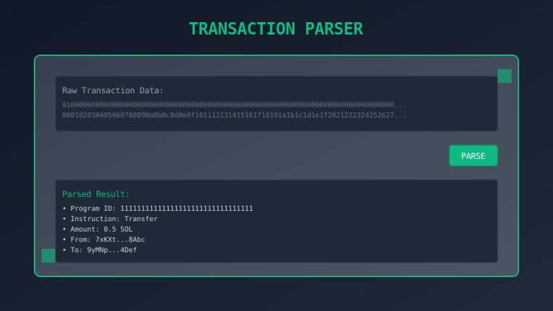
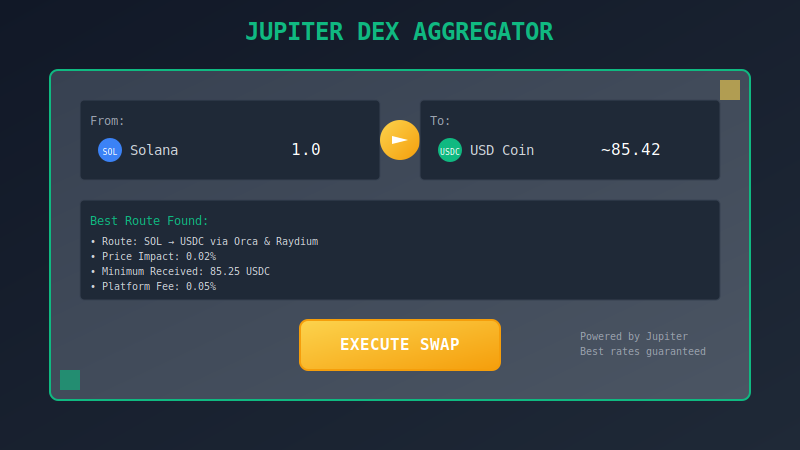
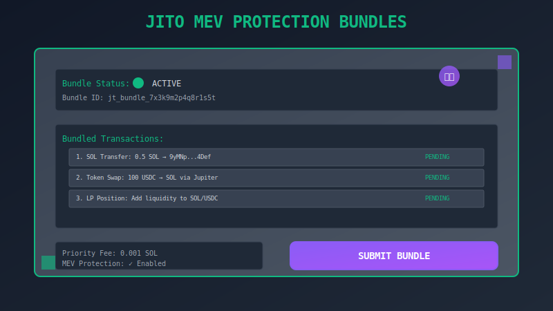

# Solana Utility Tools - All-in-One Platform


**Professional 40+ tool platform for Solana blockchain development, DeFi trading, transaction building, and developer utilities.**

[](https://nextjs.org/)
[](https://react.dev/)
[](https://www.typescriptlang.org/)
[](https://tailwindcss.com/)
[](https://solana.com/)

## 🚀 Live Demo

Visit: **[solana-util-tx.vercel.app](https://solana-util-tx.vercel.app)**

## ✨ Features Overview

### 🔧 Core Categories (40+ Tools)

#### Developer Tools (8 tools)
- **Transaction Parser** - Decode raw transactions to human-readable format
- **Vanity Address Generator** - Create custom wallet addresses with prefixes
- **Bulk Keypair Generator** - Generate multiple wallets at once
- **PDA Finder & Brute Forcer** - Program Derived Address utilities
- **Program Inspector** - Analyze deployed programs
- **IDL Generator** - Generate Interface Definition Language files
- **Solana CLI Helper** - GUI wrapper for CLI commands
- **RPC Benchmarker** - Test RPC endpoint performance

#### Transaction Management (4 tools)
- **Transaction Builder** - Build complex transactions with ease
- **Transaction Simulator** - Test transactions before execution
- **Enhanced Simulator** - Advanced simulation with detailed analysis
- **Transaction History** - Track and analyze past transactions

#### Token Operations (5 tools)
- **Token Minting** - Create new SPL tokens
- **Token Transfer** - Send tokens with batch support
- **Token Burning** - Burn tokens permanently
- **Bulk Token Operations** - Mass token operations
- **Token Analytics** - Token performance analysis

#### DeFi & Trading (3 tools)
- **Jupiter DEX Aggregator** - Best rates token swapping
- **Liquidity Management** - Pool creation and management
- **Limit Orders** - Set up automated trading orders

#### Account & Wallet Tools (5 tools)
- **Wallet Management** - Multi-wallet support
- **Multisig Wallet** - Shared wallet management
- **Account Explorer** - Analyze any Solana account
- **PDA Explorer** - Program Derived Address inspection
- **HD Wallet Generator** - Hierarchical deterministic wallets

#### Advanced Solana Features (6 tools)
- **Address Lookup Tables (ALT)** - Create, manage, and explore ALTs
- **Program Versioning** - Manage program versions and upgrades
- **State Compression** - Compressed NFT utilities
- **Token Extensions** - Advanced token features
- **Anchor CPI Helper** - Cross-program invocation tools
- **Schema Validator** - Validate Solana data schemas

#### Data Processing & Analysis (3 tools)
- **Borsh Inspector** - Decode/encode Borsh data with schemas
- **Event Log Parser** - Parse transaction logs and events
- **Binary Data Viewer** - Analyze raw binary data
- **Data Analytics Dashboard** - Comprehensive analytics

#### Jito MEV Protection (2 tools)
- **Bundle Transaction Builder** - Create MEV-protected bundles
- **Tips Calculator** - Optimize Jito tips for best execution

## 🛠️ Technology Stack

### Frontend
- **Next.js 15** - React framework with App Router
- **React 19** - Latest React with Server Components
- **TypeScript 5.8** - Type safety and developer experience
- **Tailwind CSS** - Utility-first styling
- **Pixel Art Design** - Retro gaming aesthetic

### Blockchain
- **Solana Web3.js** - Solana blockchain interaction
- **Anchor Framework** - Solana program development
- **Jupiter API** - DEX aggregation
- **Jito SDK** - MEV protection
- **Metaplex** - NFT and token standards

### Package Manager
- **pnpm** - Fast, disk space efficient package manager

## 🚀 Getting Started

### Prerequisites
- Node.js 18+ 
- pnpm (recommended)

### Installation

```bash
# Clone the repository
git clone https://github.com/lugondev/solana-util-tx.git
cd solana-util-tx

# Install dependencies
pnpm install

# Start development server
pnpm dev
```

Open [http://localhost:3333](http://localhost:3333) to view the application.

### Build for Production

```bash
# Build the application
pnpm build

# Start production server
pnpm start
```

## 📸 Screenshots

### Transaction Parser


### Jupiter DEX Aggregator  


### Jito MEV Protection


## 🔧 Key Features

### 🎯 Developer-Focused Tools
- **40+ specialized utilities** for Solana development
- **Transaction parsing and analysis** with detailed breakdowns
- **Vanity address generation** with custom prefixes
- **Bulk operations** for efficiency
- **Program inspection** and debugging tools

### 🔄 DeFi Integration
- **Jupiter DEX aggregation** for best swap rates
- **Jito MEV protection** for secure transactions
- **Liquidity management** across multiple pools
- **Limit order** automation

### 🎨 User Experience
- **Pixel art design** with retro gaming aesthetic
- **Global search** with hotkey support (/ or Cmd+K)
- **Responsive design** for all devices
- **PWA support** for offline usage
- **Dark theme** optimized for developers

### 🔒 Security & Performance
- **Client-side processing** for sensitive operations
- **Multiple RPC endpoints** for reliability
- **Transaction simulation** before execution
- **Priority fee optimization**

## 📱 PWA Features

- **Offline functionality** for key tools
- **Install as app** on desktop and mobile
- **Push notifications** for transaction updates
- **Background sync** for data updates

## 🤝 Contributing

Contributions are welcome! Please read our [Contributing Guide](CONTRIBUTING.md) for details.

### Development Guidelines
- Follow the established code style
- Add tests for new features
- Update documentation
- Use TypeScript for type safety

## 📄 License

This project is licensed under the MIT License - see the [LICENSE](LICENSE) file for details.

## 🙏 Acknowledgments

- **Solana Foundation** - Blockchain infrastructure
- **Jupiter** - DEX aggregation protocol
- **Jito Labs** - MEV protection solutions
- **Metaplex** - NFT and token standards
- **Anchor** - Solana development framework

## 📞 Support

- **Website**: [solana-util-tx.vercel.app](https://solana-util-tx.vercel.app)
- **GitHub**: [lugondev/solana-util-tx](https://github.com/lugondev/solana-util-tx)
- **Issues**: [GitHub Issues](https://github.com/lugondev/solana-util-tx/issues)

---

**Built with ❤️ for the Solana ecosystem by [LugonDev](https://github.com/lugondev)**